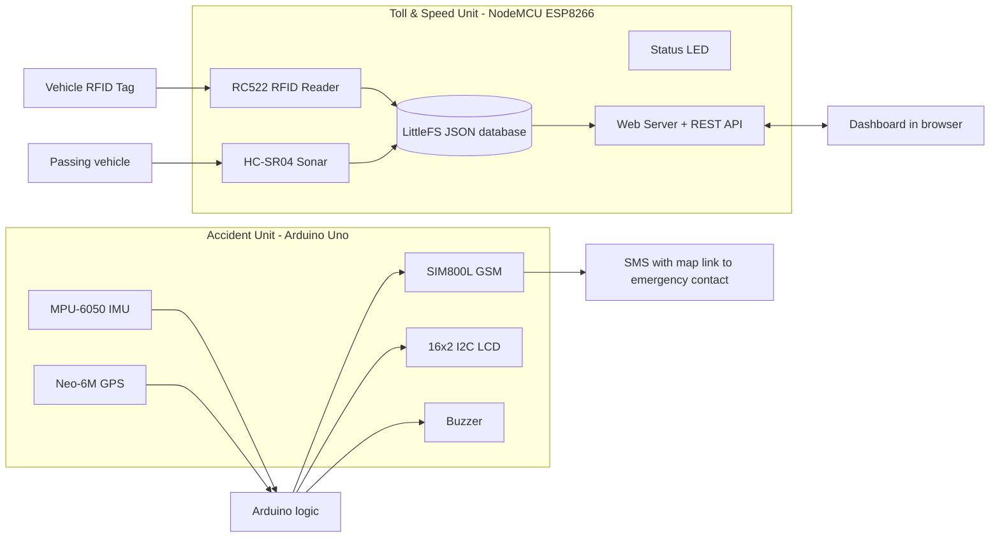

# Vehicle Safety & Automated Traffic Monitoring System

> A two-unit embedded system that **detects accidents and sends an SMS with the GPS location**, **collects tolls automatically via RFID**, and **fines over-speeding vehicles**, all managed from a live web dashboard.

**Course:** CSE 3118: Microprocessor & Microcontroller Lab
**University:** Ahsanullah University of Science and Technology (AUST)
**Team:** _&lt;add teammate names&gt;_ | **Supervisor:** _&lt;add teacher name&gt;_

---

## 📑 Table of Contents
1. [Overview](#-overview)
2. [Features](#-features)
3. [System Architecture](#-system-architecture)
4. [Hardware Required](#-hardware-required)
5. [Pin Diagrams](#-pin-diagrams)
6. [Software Setup](#-software-setup)
7. [How It Works](#-how-it-works)
8. [Web Dashboard & REST API](#-web-dashboard--rest-api)
9. [Configuration Reference](#-configuration-reference)
10. [Calibration & Testing Tips](#-calibration--testing-tips)
11. [Limitations & Future Work](#-limitations--future-work)
12. [Repository Structure](#-repository-structure)

---

## 🔭 Overview

The project is split into two independent units:

| Unit | Board | Purpose |
|---|---|---|
| **Toll & Speed Unit** ("Hawkeye") | NodeMCU ESP8266 | RFID toll collection, sonar-based speed trap, automatic fines, Wi-Fi web dashboard |
| **Accident Detection Unit** (on-vehicle) | Arduino Uno | Crash / rollover detection with an MPU-6050, GPS location, SMS alert over GSM, LCD + buzzer feedback |

---

## ✨ Features

**Toll & Speed Unit**
- 💳 Contactless toll: the RFID tag is scanned and the toll is deducted instantly from the car's account
- 📡 Speed trap armed automatically after each RFID scan; speed is measured with an ultrasonic sensor
- 🚨 Automatic fine if the measured speed exceeds the limit
- 🖥️ Live web dashboard: register cars, top up balances, view logs, change toll / fine / speed limit at runtime
- ⚠️ Unregistered cards are tracked too (negative balance accrues and is merged when the card is registered later)
- 💾 All data stored on the ESP8266 flash (LittleFS), so it survives reboots

**Accident Detection Unit**
- 💥 Hard-impact detection (total acceleration ≥ threshold)
- 🔄 Rollover / flip detection (tilt ≥ 60° held for 2 s, which avoids false alarms from bumps and turns)
- 📍 GPS coordinates sent as a Google Maps link in an SMS
- 📟 16×2 LCD shows live force and tilt; buzzer gives audible feedback

---

## 🧩 System Architecture



---

## 🛠️ Hardware Required

### Toll & Speed Unit
| Qty | Component |
|---|---|
| 1 | NodeMCU ESP8266 (ESP-12E, v1.0 / v3) |
| 1 | RC522 RFID reader (13.56 MHz) + MIFARE tags/cards |
| 1 | HC-SR04 ultrasonic sensor |
| 1 | LED + 220 Ω resistor |
| 2 | Resistors (1 kΩ + 2 kΩ) for the HC-SR04 ECHO voltage divider |
| 1 | Breadboard / jumper wires, 5 V USB supply |

### Accident Detection Unit
| Qty | Component |
|---|---|
| 1 | Arduino Uno (ATmega328P) |
| 1 | MPU-6050 (GY-521) accelerometer/gyro |
| 1 | Neo-6M GPS module |
| 1 | SIM800L GSM module + active SIM with SMS credit |
| 1 | 16×2 LCD with I2C backpack (address `0x27`) |
| 1 | Active buzzer |
| 1 | Separate 3.7–4.2 V supply (≥ 2 A peak) for SIM800L (Li-ion / buck converter) |
| 2 | Resistors (1 kΩ + 2 kΩ) for the SIM800L RXD voltage divider |

---

## 📌 Pin Diagrams

### 1️⃣ Toll & Speed Unit: NodeMCU ESP8266

| Module | Module Pin | NodeMCU Pin | GPIO | Notes |
|---|---|---|---|---|
| **RC522 RFID** | 3.3V | 3V3 | – | ⚠️ **3.3 V only. Never 5 V** |
| | GND | GND | – | |
| | RST | D4 | GPIO2 | `RFID_RST` |
| | SDA (SS) | D8 | GPIO15 | `RFID_SS` |
| | SCK | D5 | GPIO14 | hardware SPI |
| | MISO | D6 | GPIO12 | hardware SPI |
| | MOSI | D7 | GPIO13 | hardware SPI |
| | IRQ | – | – | not connected |
| **HC-SR04 Sonar** | VCC | VIN | – | 5 V (from USB) |
| | GND | GND | – | |
| | TRIG | D1 | GPIO5 | `TRIG_PIN` |
| | ECHO | D2 | GPIO4 | `ECHO_PIN`, **via 1 kΩ/2 kΩ divider** (ECHO is 5 V) |
| **Status LED** | Anode (+) | D3 | GPIO0 | `LED_PIN`, through 220 Ω resistor |
| | Cathode (−) | GND | – | |


**ECHO voltage divider:**
```
HC-SR04 ECHO ──[ 1 kΩ ]──┬── NodeMCU D2
                         │
                       [ 2 kΩ ]
                         │
                        GND
```

---

### 2️⃣ Accident Detection Unit: Arduino Uno

| Module | Module Pin | Arduino Pin | Notes |
|---|---|---|---|
| **MPU-6050** | VCC | 5V (or 3.3V) | GY-521 has an on-board regulator |
| | GND | GND | |
| | SDA | A4 | I2C data (shared with LCD) |
| | SCL | A5 | I2C clock (shared with LCD), I2C address `0x68` |
| **16×2 I2C LCD** | VCC | 5V | |
| | GND | GND | |
| | SDA | A4 | I2C address `0x27` |
| | SCL | A5 | |
| **Neo-6M GPS** | VCC | 5V (or 3.3V) | |
| | GND | GND | |
| | **TX** | **D4** | `GPS_RX_PIN`, GPS TX goes to Arduino RX |
| | **RX** | **D3** | `GPS_TX_PIN`, GPS RX goes to Arduino TX |
| **SIM800L GSM** | VCC | **External 3.7–4.2 V supply** | ⚠️ Do **not** power from the Arduino 5 V / 3.3 V pin (needs ~2 A peaks) |
| | GND | GND (**common ground** with Arduino) | |
| | **TXD** | **D8** | `GSM_RX_PIN`, SIM TXD goes to Arduino RX |
| | **RXD** | **D7** | `GSM_TX_PIN`, **via 1 kΩ/2 kΩ divider** (5 V → ~3.3 V) |
| **Buzzer** | (+) | D5 | `BUZZER_PIN` |
| | (−) | GND | |


**SIM800L RXD voltage divider:**
```
Arduino D7 ──[ 1 kΩ ]──┬── SIM800L RXD
                       │
                     [ 2 kΩ ]
                       │
                      GND
```

> ⚠️ **Common ground** is required: Arduino GND, SIM800L GND, and the external supply GND must all be connected together.

---

## 💻 Software Setup

### Libraries
| Unit | Library | Notes |
|---|---|---|
| Toll | ESP8266 Arduino core | Boards Manager URL: `http://arduino.esp8266.com/stable/package_esp8266com_index.json` |
| Toll | `ESP8266WiFi`, `ESP8266WebServer`, `LittleFS`, `SPI` | bundled with the core |
| Toll | **ArduinoJson v7** | needed for `JsonDocument` / `add<JsonObject>()` |
| Toll | **MFRC522** | RFID driver |
| Accident | `Wire`, `SoftwareSerial` | bundled |
| Accident | **TinyGPSPlus** | GPS NMEA parsing |
| Accident | **LiquidCrystal_I2C** | I2C LCD |

### Upload: Toll & Speed Unit
1. Open `toll_system/traffic_toll_system-v3.ino`.
2. Edit your Wi-Fi credentials:
   ```cpp
   const char* WIFI_SSID     = "YOUR_WIFI_NAME";
   const char* WIFI_PASSWORD = "YOUR_WIFI_PASSWORD";
   ```
3. Select **Board:** `NodeMCU 1.0 (ESP-12E Module)` and a **Flash Size** that includes a filesystem (e.g. `4MB (FS:1MB)`).
4. Upload, then open the Serial Monitor at **115200 baud**.
5. Note the printed IP address: `Hawkeye Dashboard ready at: http://<ip>`
6. Open that address in a browser on the **same Wi-Fi network**.

### Upload: Accident Detection Unit
1. Open `accident_detection/car_acc.ino`.
2. Set the emergency number (with country code):
   ```cpp
   const String EMERGENCY_NUMBER = "+8801XXXXXXXXX";
   ```
3. Select **Board:** `Arduino Uno`, upload, and open the Serial Monitor at **9600 baud**.
4. Wait for the LCD to show **"System Ready!"**. Make sure the SIM800L has registered on the network and the GPS has a fix (open sky, can take a few minutes on first start).

---

## ⚙️ How It Works

### Toll & Speed flow
```
RFID card scanned
      │
      ├─ Registered?  ── yes ─► deduct TOLL from balance
      └─ Unregistered? ─ yes ─► create/update record (balance goes negative)
      │
      ▼
Speed trap ARMED (10 s window)
      │
Vehicle enters sonar zone (distance ≤ DETECT_CM)  → start timer
Vehicle leaves sonar zone                         → stop timer
      │
      ▼
speed (km/h) = (VEHICLE_LEN_M / time_in_zone_s) × 3.6
      │
      ├─ speed > SPEED_LIMIT_KMH → FINE deducted, LED on 3 s, logged as "fine"
      └─ otherwise               → logged as "speed_ok", LED blinks
```

- The speed trap times out if no vehicle enters within **10 s** of the scan, or stays in the zone for more than **4 s**.
- **Example:** vehicle length 0.5 m, time in zone 0.30 s → 0.5 / 0.30 × 3.6 = **6.0 km/h**. With a 5 km/h limit this triggers a fine.

**LED indicator**
| Event | LED |
|---|---|
| RFID scanned | ON for 1 s |
| Vehicle enters sonar zone | short blink |
| Normal speed on exit | short blink |
| Over-speed | ON for 3 s |

### Accident detection logic
Acceleration is read from the MPU-6050 (±2 g range, 16384 LSB/g):

- **Total force** `|a| = √(ax² + ay² + az²)`
- **Tilt angle** `θ = acos(az / |a|)`

| Accident type | Condition | Default |
|---|---|---|
| 💥 Hard impact | `|a| ≥ IMPACT_THRESHOLD` | 2.10 g |
| 🔄 Rollover / flip | `θ ≥ FLIP_THRESHOLD` continuously for `FLIP_DURATION` | 60° for 2000 ms |

On detection the unit: shows **! ACCIDENT !** on the LCD → sounds the buzzer → builds the SMS (with a Google Maps link if the GPS has a valid fix) → sends it through the SIM800L using AT commands (`AT+CMGF=1`, `AT+CMGS`) → shows **SMS Sent!**

**Sample SMS**
```
EMERGENCY: Accident Detected!
Hard Impact (2.4G)
Location: https://maps.google.com/?q=23.810331,90.412521
```

If the GPS has no fix yet, the SMS says the satellites are still being acquired.

---

## 🖥️ Web Dashboard & REST API

The dashboard ("Hawkeye") refreshes every second and provides:
- Live passage time / speed with **CLEAR ROAD / NORMAL SPEED / OVERSPEED** badge
- Runtime settings: toll fee, fine fee, speed limit
- Vehicle registration, top-up and deletion
- Unregistered-card table with a one-click "Register UID"
- Transaction & fine log (latest 20 shown)

| Method | Endpoint | Description |
|---|---|---|
| GET | `/` | Dashboard page |
| GET | `/api/status` | Last speed / time, pending fine, current toll, fine, limit |
| POST | `/api/settings` | Update `speedLimitKmh`, `tollTk`, `fineTk` |
| GET | `/api/cars` | List registered cars |
| POST | `/api/cars` | Register / update a car `{uid, owner, balance}` |
| POST | `/api/cars/delete` | Delete a car `{uid}` |
| POST | `/api/topup` | Add balance `{uid, amount}` |
| GET | `/api/unregistered` | List unregistered cards |
| POST | `/api/unregistered/delete` | Remove an unregistered card `{uid}` |
| GET | `/api/logs` | Transaction log (max 100 entries) |
| POST | `/api/logs/delete` | Delete one log entry `{id, index}` |
| POST | `/api/logs/clear` | Clear all logs |

**Stored files (LittleFS):** `/cars.json`, `/unregistered.json`, `/logs.json`

---

## 🔧 Configuration Reference

**Toll & Speed Unit** (`traffic_toll_system-v3.ino`)
| Constant | Default | Meaning |
|---|---|---|
| `VEHICLE_LEN_M` | `0.5` | Length of the test vehicle in metres (used to compute speed) |
| `SPEED_LIMIT_KMH` | `5.0` | Speed limit (set low for a table-top test rig) |
| `TOLL_TK` | `50.0` | Toll per scan (৳) |
| `FINE_TK` | `200.0` | Over-speed fine (৳) |
| `DETECT_CM` | `10.0` | Max sonar distance that counts as "vehicle present" |

Toll, fine and speed limit can also be changed live from the dashboard (they reset to these defaults on reboot).

**Accident Detection Unit** (`car_acc.ino`)
| Constant | Default | Meaning |
|---|---|---|
| `IMPACT_THRESHOLD` | `2.10` | Impact trigger in g |
| `FLIP_THRESHOLD` | `60.0` | Tilt angle trigger in degrees |
| `FLIP_DURATION` | `2000` | Time the tilt must be held (ms) |
| `EMERGENCY_NUMBER` | `"+8801XXXXXXXXX"` | SMS recipient |

---

## 🧪 Calibration & Testing Tips

- **Speed trap:** place the sonar so the vehicle passes about 5 to 8 cm in front of it, measure your vehicle's real length, and set `VEHICLE_LEN_M` to it. Tune `SPEED_LIMIT_KMH` to match your test rig.
- **Register a card:** scan an unknown card first, since its UID appears under *Unregistered Scans*, then click **Register UID**.
- **Accident test:** do not crash the hardware 🙂. Shake or tap the board firmly to cross the impact threshold, or hold it tilted past 60° for 2 s to test the flip alert. Lower `IMPACT_THRESHOLD` if your bench shake doesn't reach it.
- **GPS:** test outdoors or by a window. Indoors there is usually no fix, so the SMS will say "satellites acquiring".
- **GSM:** the SIM800L needs a stable supply. If it resets or does not respond, check the power source and common ground first.

---

## ⚠️ Limitations & Future Work

- The SMS currently goes to **one configured number**; add more numbers (hospital + family) by repeating the send routine per number.
- The "nearest hospital" is chosen by whichever number you configure; automatic hospital lookup from GPS is not implemented.
- Speed is estimated from a single sonar and an assumed vehicle length. It is accurate for a prototype rig, not for real highway speeds.
- The dashboard has no authentication and runs over plain HTTP on the local network.
- Settings changed from the dashboard are not persisted across reboots.
- Possible extensions: dual-sensor speed measurement, HTTPS + login, cloud database, multi-recipient SMS, a battery backup and a proper enclosure.

---


## 🙏 Acknowledgements
CSE 3118 course teachers and lab staff, AUST.
